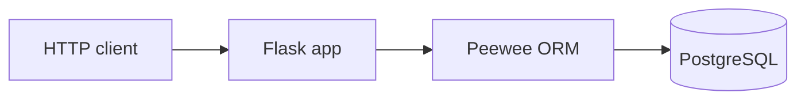

# MLH PE Hackathon — URL shortener API

Flask REST API with Peewee ORM and PostgreSQL: users, shortened URLs, events/analytics, and CSV bulk user import.

**Stack:** Flask · Peewee · PostgreSQL · uv

## Table of contents

1. [Quick start (setup)](#quick-start-setup)
2. [Architecture](#architecture)
3. [Observability (Loki, Prometheus, Grafana)](#observability-loki-prometheus-grafana)
4. [API reference](#api-reference)
5. [Project layout](#project-layout)
6. [Hackathon / seed data](#hackathon--seed-data)
7. [Extending the project](#extending-the-project)

---

## Quick start (setup)

Follow these steps in order.

### 1. Install uv

`uv` installs Python and dependencies for this repo.

**macOS / Linux:**

```bash
curl -LsSf https://astral.sh/uv/install.sh | sh
```

**Windows (PowerShell):**

```powershell
powershell -ExecutionPolicy ByPass -c "irm https://astral.sh/uv/install.ps1 | iex"
```

More options: [uv installation](https://docs.astral.sh/uv/getting-started/installation/).

### 2. Clone and install dependencies

```bash
git clone https://github.com/samokw/PE-Hackathon-2026.git
cd PE-Hackathon-2026
uv sync
```

`uv sync` creates a `.venv` and installs everything from `pyproject.toml`.

### 3. Run PostgreSQL

The app needs a **PostgreSQL** instance. Pick one of the options below.

#### Option A — Docker (quick local database)

Install [Docker Desktop](https://www.docker.com/products/docker-desktop/) (macOS / Windows) or Docker Engine (Linux), then run:

```bash
docker run --name hackathon-postgres \
  -e POSTGRES_USER=postgres \
  -e POSTGRES_PASSWORD=postgres \
  -e POSTGRES_DB=hackathon_db \
  -p 5432:5432 \
  -d postgres:16
```

This starts PostgreSQL **16** in the background with:

- **User:** `postgres`
- **Password:** `postgres`
- **Database:** `hackathon_db`
- **Port:** `5432` on your machine → matches the defaults in [`.env.example`](.env.example)

Check that the container is running:

```bash
docker ps
```

To stop it later: `docker stop hackathon-postgres`. To remove it: `docker rm hackathon-postgres`.

If port **5432** is already in use on your computer, map a different host port (example **5433**) and set `DATABASE_PORT=5433` in `.env`:

```bash
docker run --name hackathon-postgres \
  -e POSTGRES_USER=postgres \
  -e POSTGRES_PASSWORD=postgres \
  -e POSTGRES_DB=hackathon_db \
  -p 5433:5432 \
  -d postgres:16
```

#### Option B — PostgreSQL already installed locally

Create the database (name should match `DATABASE_NAME` in `.env`, default `hackathon_db`):

```bash
createdb hackathon_db
```

### 4. Configure environment

```bash
cp .env.example .env
```

Edit `.env` so `DATABASE_HOST`, `DATABASE_PORT`, `DATABASE_NAME`, `DATABASE_USER`, and `DATABASE_PASSWORD` match your Postgres instance.

### 5. Start the API

```bash
uv run run.py
```

On first run, `run.py` creates tables (`User`, `Url`, `UrlEvent`) if they do not exist.

### 6. Verify

In another terminal:

```bash
curl http://127.0.0.1:5000/health
```

Expected: `{"status":"ok"}`

### Troubleshooting

| Problem | What to try |
|--------|-------------|
| `connection refused` / cannot connect to DB | Start PostgreSQL; check host/port in `.env`. |
| `relation "user" does not exist` (or similar) | Run `uv run run.py` once so `create_tables` runs, or check you are using the same database as in `.env`. |
| `uv: command not found` | Open a new terminal after installing uv, or add uv to your PATH per the installer message. |

---

## Architecture

Traffic flows from the HTTP client into **Flask**, which uses **Peewee** models to read and write **PostgreSQL**.



- **`app/__init__.py`** — `create_app()`, registers routes and `/health`.
- **`app/database.py`** — DB proxy, connection per request.
- **`app/models/`** — `User`, `Url`, `UrlEvent`.
- **`app/routes/`** — Blueprints for users, URLs, events (`register_routes`).
- **`app/seed.py`** — `load_csv(filepath)` for bulk user CSV import.

---

## Observability (Loki, Prometheus, Grafana)

Logs are **JSON lines** on stdout; for a browser UI (quest / ops), duplicate them to a file and ship them with **Promtail → Loki → Grafana**. **Prometheus** scrapes **`/metrics`** (same host by default) so Grafana can query counters and process metrics for dashboards (Golden Signals–style traffic and errors).

1. On the server, create a log directory and set in `.env`:
   - `LOG_FILE=/var/log/hackathon/app.log`
2. Ensure the user running the API can write that path (see [`observability/README.md`](observability/README.md)).
3. From [`observability/`](observability/): `docker compose up -d`
4. Open **Grafana** at `http://YOUR_SERVER:3000` → **Explore** → **Loki** (`{job="hackathon"}`) or **Prometheus** (`http_requests_total`).
5. Optional: **Prometheus** UI at `http://YOUR_SERVER:9090` → **Status → Targets** to confirm the scrape is **UP**.

Details, ports, scrape configuration, and security notes: **[observability/README.md](observability/README.md)**.

---

## API reference

Base URL: `http://127.0.0.1:5000` (default Flask port) unless you change it.

### Health & metrics

| Method | Path | Description |
|--------|------|-------------|
| `GET` | `/health` | Liveness check. Response: `{"status": "ok"}`. |
| `GET` | `/metrics` | Prometheus text format: default process/Python collectors + `http_requests_total`, `http_errors_total`, `http_request_duration_seconds` (histogram). |

### Users

| Method | Path | Description |
|--------|------|-------------|
| `POST` | `/users/bulk` | Multipart form: field `file` with CSV (`username`, `email`, `created_at`, optional `id`). Response includes import count (e.g. `{"count": N}`). |
| `GET` | `/users` | List users. Optional query: `page`, `per_page` → paginated `{"users": [...]}`. |
| `GET` | `/users/<id>` | Single user by id. |
| `POST` | `/users` | JSON body: `username`, `email`. Creates user. |
| `PUT` | `/users/<id>` | JSON body: `username` (update). |
| `DELETE` | `/users/<id>` | Deletes user and related URLs/events as needed. |

### URLs

| Method | Path | Description |
|--------|------|-------------|
| `POST` | `/urls` | JSON: `user_id`, `original_url`, `title`. Creates short link; returns `short_code`. |
| `GET` | `/urls` | List URLs. Query: `user_id`, `is_active` (`true` / `false`). |
| `GET` | `/urls/<short_code>/redirect` | HTTP redirect to `original_url` if active. |
| `GET` | `/urls/<id>` | Single URL by numeric id. |
| `PUT` | `/urls/<id>` | JSON: optional `title`, `is_active`. |
| `DELETE` | `/urls/<id>` | Deletes URL and its events. |

### Events

| Method | Path | Description |
|--------|------|-------------|
| `GET` | `/events` | List analytics events. |
| `POST` | `/events` | JSON: `url_id`, `user_id`, `event_type`, `details` (object). Creates event. |

---

## Project layout

```
PE-Hackathon-2026/
├── app/
│   ├── __init__.py          # create_app(), /health
│   ├── database.py          # Peewee database proxy
│   ├── models/              # User, Url, UrlEvent
│   ├── routes/              # users, urls, events blueprints
│   ├── routes/helpers.py    # JSON serializers
│   └── seed.py              # load_csv() for users
├── .env.example
├── observability/           # Docker Compose: Loki, Promtail, Prometheus, Grafana
├── pyproject.toml
├── run.py                   # uv run run.py — serves app, create_tables
└── README.md
```

---

## Hackathon / seed data

Work with the seed assets and instructions on the [MLH PE Hackathon](https://mlh-pe-hackathon.com) platform to align your schema and test data with judging. Use Discord or the Q&A tab if you need help.

---

## Extending the project

### Add a model

1. Add a file under `app/models/` inheriting from `BaseModel`.
2. Import the model in `app/models/__init__.py`.
3. Include it in `db.create_tables([...])` in `run.py` (or your migration flow).

### Add routes

1. Add handlers to a blueprint under `app/routes/`.
2. Register the blueprint in `app/routes/__init__.py` inside `register_routes(app)`.

### CSV loading

Bulk user import must keep using **`load_csv(filepath)`** in `app/seed.py` as the entrypoint for CSV files.

### Useful Peewee patterns

```python
from peewee import fn
from playhouse.shortcuts import model_to_dict

# Example: filter, get by id, dict for JSON
rows = MyModel.select().where(MyModel.field == value)
row = MyModel.get_by_id(1)
model_to_dict(row)
```

- Use `db.atomic()` around bulk inserts.
- Connections are closed on teardown via `app/database.py`.

See `.env.example` for configuration variables.
